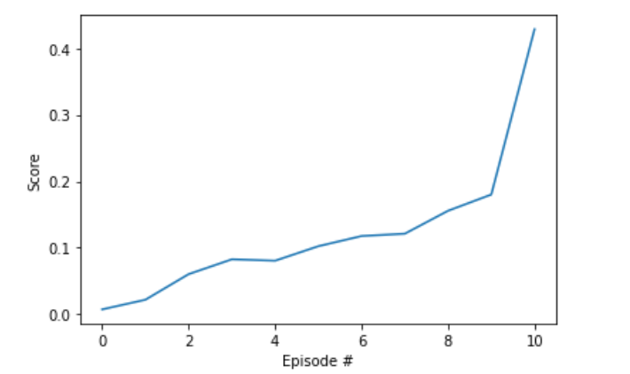
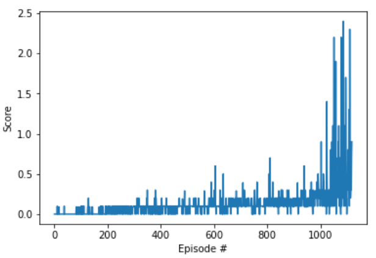

## Report
### Algorithm Introduction
In this project, we applied Actor-Critic model-free algorithm, base on the paper [Continuous Control with Deep Reinforcement Learning](https://arxiv.org/abs/1509.02971). We resolve the project by DDPG(Deep Deterministic Policy Gradient). DDPG  is an algorithm used for solving continuous control problems in reinforcement learning. It is an extension of the DQN (Deep Q-Network) algorithm for continuous action spaces.
In DDPG, we use an actor-critic architecture, where the actor is responsible for learning the policy (the action selection), and the critic evaluates the policy by estimating the value function. The actor and critic are both deep neural networks.

Here's a step-by-step explanation of how DDPG works:

**Initialize the actor and critic networks**: We start by initializing the actor and critic networks with random weights.

**Initialize the target networks**: We create target networks for both the actor and critic, which are copies of the original networks. These target networks are used to stabilize the learning process.

**Initialize the replay buffer**: We create a replay buffer to store the experiences of the agent. This buffer is used to sample random batches of experiences for training.

**Select an action**: The actor network takes the current state as input and outputs an action. To add exploration to the action selection process, we add noise to the output action.

**Execute the action**: The selected action is sent to the environment, and the agent observes the next state and the reward.

**Store the experience**: The agent stores the experience (state, action, reward, next state) in the replay buffer.

**Sample a batch from the replay buffer**: Random batches of experiences are sampled from the replay buffer.

**Update the critic network**: The critic network is updated by minimizing the mean squared error between the predicted Q-values and the target Q-values. The target Q-values are calculated using the target actor and target critic networks.

**Update the actor network**: The actor network is updated by performing gradient ascent on the expected return. The gradients are computed using the critic network.

**Update the target networks**: The target actor and target critic networks are updated by slowly blending their weights with the original actor and critic networks.

Repeat steps 4-10: The agent repeats steps 4-10 for multiple episodes, gradually improving its policy and value function estimation.

DDPG is known for its ability to handle continuous action spaces and its stability in training. It has been successfully applied to various tasks, including robotic control and game playing.

In this project, we have two collaborative and competitive agents, each agent has its own Actor Critic model set.

We have applied these methods:

1. replay buffer to minimize correlations between samples
2. each network has separate local network and target network, target network is to give consistent prediction while local network is to train and learn.
3. soft update. We update target network using TAU which is very small to change little by little from local network to improve stability of learning.
   $$\theta_{target} = \tau\theta_{local}  + (1-\tau)\theta_{target}$$
5. batch normalization. We using batch normalization to scale the features so thay are in similar ranges across environments and units. The technique normalize each dimension across the samples in a minibatch to have unit mean and variance.
6. update interval and learning interval. Skipping some timesteps to learn the local network and every some learnsteps update the target network
7. adding noise to action. We constructed an exploration policy by adding noise sampled from a noise process to our actor policy. Pay attention to reset the noise process after each adding.
   $$x_{noise} = x + \theta (\mu - x) + \sigma Unif(a)$$
where
- $x$ is the original state value
- $x_{noise}$ is the state value with noise
- $\mu$ is 0
- $\theta$ is 0.15
- $\sigma$ is 0.5
- $Unif(a)$ returns an array of random numbers with the action size and following a Uniform Distribution.
8. noise decay. We use noise parameter with decay to decrease noise adding to action ,which means more exploration in the early training episodes and less exploration in the later episodes.

### Implementation

  **Highlevel pseudo-code of the algorithm**

    Init random weights for  target and local critic and actor.
    Init replay memory
    Init noise process(OU noise)
    foreach episode
        Initialize a random process for action exploration (OU noise)
        Get a initial state
        for each step in episode:
            Choose an action using actor policy and exploration noise
            Noise decay
            Take action and observe the reward and next state
            Store the experience tuple in the replay buffer
    
            if we have enough experiences(batchsize):
                Get a batchsize of tuples 
                Get predicted next-state actions and Q values from target models
                Compute Q targets for current states (y_i)
                Predict Q expected from local model(Q_expected)
                Compute critic loss(y_i and Q_expected)
                Minimize the critic loss
                Compute actor loss
                Minimize the actor loss
                
                
                soft update critic and actor target
                    
                
   **Hyperparameters**

        BUFFER_SIZE = int(1e5)  # replay buffer size
        BATCH_SIZE = 64         # minibatch size
        GAMMA = 0.99            # discount factor
        TAU = 1e-2              # for soft update of target parameters
        LR_ACTOR = 5e-3         # learning rate of the actor 
        LR_CRITIC = 5e-3        # learning rate of the critic
        WEIGHT_DECAY = 0        # L2 weight decay
        UPDATE_EVERY = 1        # skip learning step
        UPDATE_COUNT = 1        # update counts in one step
    
   **Neural Networks**

    We have two sets of actor network, critic network and their target clones, each agent has its own set. The two instances of actor critic network using the same structure.
     
    The architecture is multi-layer perceptrons. Input layer matches the state size then we have 2 hidden fully connected layers ,each layer followed by a batchnorm layer and finaly the output layer.
    
    Critics:
        state_size(24) * 256, +action_size(2)  * 128 --> output 1 value (The Q value of the action,state value)
        
    Actors:
        state_size(24) * 256 * 128  --> output action_size values(size 2) (the best believed action to perform)

### Code Structure

- p3_ddpg_model.py contains the torch implementation of the Actor Critic neural networks that are being used in the project.

- p3_ddpg_agent.py contains the core of the project, such as agent.learn(),agent.step(),agent.act() and noise process, replay buffer

- Tennis.ipynb puts togheter all the pieces to build and train the agent.

### Result
After around 1300 episodes the avg score_deque(100) get higher than 0.5

### Ideas for Future Work

To improve the agent's performance we can also try DQN related improvements like prioritized experienced replay. We can also try more complicated network like more layers and weights.
